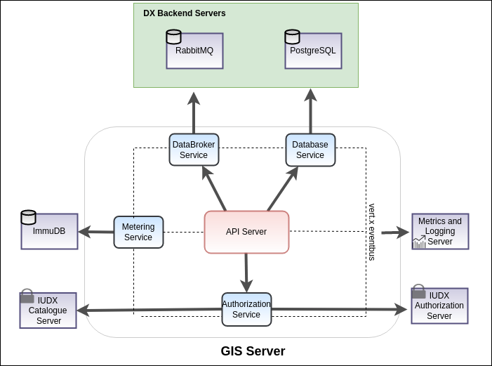

# iudx-gis-interface
The GIS interface is a resource server which defines the interactions between the consumers interested in GIS data and the upstream GIS Servers.
The gis interface is [IUDXs](https://iudx.org.in) data discovery, data publication.
It allows admins to publish their gis related info in accordance to the IUDX vocabulary annotated meta-data document.
The consumers can access data from the gis interface using HTTPs.

<p align="center">

</p>


## Features

- Provides data access from available resources using standard APIs.
- Integration with authorization server (token introspection) to serve private data as per the access control policies set by the provider.
- Allows admin to publish, edit or delete gis related info as per IUDX data descriptor.
- Secure data access over TLS.
- Scalable, service mesh architecture based implementation using open source components: Vert.X API framework, PostgreSQL for database and RabbitMQ for data broker.
- Hazelcast and Zookeeper based cluster management and service discovery.

## API Docs
The api docs can be found [here](https://gis.iudx.org.in/apis).

## Prerequisites
### External Dependencies Installation

The Gis-interface Server connects with various external dependencies namely
- PostgreSQL
- ImmuDB
- RabbitMQ

Find the installations of the above along with the configurations to modify the database url, port and associated credentials in the appropriate sections
[here](SETUP.md)

## Get Started

### Docker based
1. Install docker and docker-compose
2. Clone this repo
3. Build the images
   ` ./docker/build.sh`
4. Modify the `docker-compose.yml` file to map the config file you just created
5. Start the server in production (prod) or development (dev) mode using docker-compose
   ` docker-compose up prod `


### Maven based
1. Install java 13 and maven
2. Use the maven exec plugin based starter to start the server
   `mvn clean compile exec:java@gis-server`

### JAR based
1. Install java 11 and maven
2. Set Environment variables
```
export RS_URL=https://<rs-domain-name>
export LOG_LEVEL=INFO
```
3. Use maven to package the application as a JAR
   `mvn clean package -Dmaven.test.skip=true`
4. 2 JAR files would be generated in the `target/` directory
    - `iudx.gis.interface-cluster-0.0.1-SNAPSHOT-fat.jar` - clustered vert.x containing micrometer metrics
    - `iudx.gis.interface-dev-0.0.1-SNAPSHOT-fat.jar` - non-clustered vert.x and does not contain micrometer metrics

#### Running the clustered JAR

**Note**: The clustered JAR requires Zookeeper to be installed. Refer [here](https://zookeeper.apache.org/doc/r3.3.3/zookeeperStarted.html) to learn more about how to set up Zookeeper. Additionally, the `zookeepers` key in the config being used needs to be updated with the IP address/domain of the system running Zookeeper.

The JAR requires 3 runtime arguments when running:

* --config/-c : path to the config file
* --hostname/-i : the hostname for clustering
* --modules/-m : comma separated list of module names to deploy

e.g. `java -jar target/iudx.gis.interface-cluster-0.0.1-SNAPSHOT-fat.jar  --host $(hostname) -c configs/config.json -m iudx.gis.interface.database.archives.DatabaseVerticle,iudx.gis.interface.authenticator.AuthenticationVerticle
,iudx.gis.interface.metering.MeteringVerticle,iudx.gis.interface.database.postgres.PostgresVerticle`

Use the `--help/-h` argument for more information. You may additionally append an `RS_JAVA_OPTS` environment variable containing any Java options to pass to the application.

e.g.
```
$ export RS_JAVA_OPTS="-Xmx4096m"
$ java $RS_JAVA_OPTS -jar target/iudx.gis.interface-cluster-0.0.1-SNAPSHOT-fat.jar ...
```

#### Running the non-clustered JAR
The JAR requires 1 runtime argument when running:

* --config/-c : path to the config file

e.g. `java -Dvertx.logger-delegate-factory-class-name=io.vertx.core.logging.Log4j2LogDelegateFactory -jar target/iudx.gis.interface-dev-0.0.1-SNAPSHOT-fat.jar -c configs/config.json`

Use the `--help/-h` argument for more information. You may additionally append an `RS_JAVA_OPTS` environment variable containing any Java options to pass to the application.

e.g.
```
$ export RS_JAVA_OPTS="-Xmx1024m"
$ java $RS_JAVA_OPTS -jar target/iudx.gis.interface-dev-0.0.1-SNAPSHOT-fat.jar ...
```

### Testing

### Unit tests
1. Run the server through either docker, maven or redeployer
2. Run the unit tests and generate a surefire report
   `mvn clean test-compile surefire:test surefire-report:report`
3. Reports are stored in `./target/`


## Contributing
We follow Git Merge based workflow
1. Fork this repo
2. Create a new feature branch in your fork. Multiple features must have a hyphen separated name, or refer to a milestone name as mentioned in Github -> Projects
3. Commit to your fork and raise a Pull Request with upstream

## License
[MIT](./LICENSE.txt)
